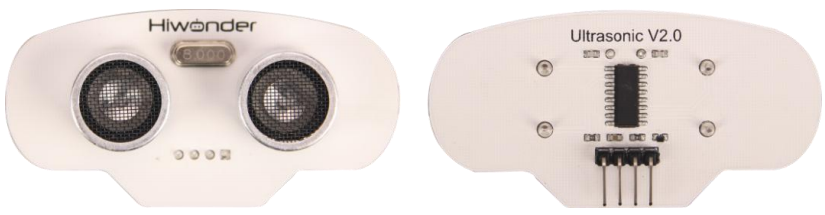

# 1. Ultrasonic Sensor Manual

## 1.1 Ultrasonic Sensor Description

### 1.1.1 Sensor Introduction

This ultrasonic distance measurement module primarily consists of an ultrasonic distance chip. The chip integrates an ultrasonic transmitting circuit, ultrasonic receiving circuit, and digital processing circuit.

It is widely used for automatic obstacle avoidance in smart cars and robotic field.

### 1.1.2 Working Principle

This module uses I/O pins to trigger distance measurement. The measurement principle is as follows: the module's control pin sends a 10 μs high-level pulse, which triggers the module to emit eight 40 kHz square waves, and then it detects whether a signal is returned. If there is a signal returned, a high level will be output, and the duration of the high level is the time from the emission to the return of the ultrasonic wave. The square wave transmission speed is the same as that of the sound module, which is 346M/S. That is to say, it takes 28.9μs for the square wave to transmit 1cm.

The distance can be calculated using the formula: test distance (cm) = high level time (μs) / 58 (μs/cm)

## 1.2 Notice

1.  Do not exceed the rated voltage range during use.

2.  Do not use materials that transmit visible light or infrared light as test objects.

3.  Avoid strong light exposure and do not block the light on the test object during use.

4.  Do not operate the sensor in humid environments.

## 1.3 Specifications

For more information of this chip, you may refer to **"[Ultrasonic sensor schematic.](https://drive.google.com/drive/folders/1OtYIsa3EOEMCRTllLuAo_mS2Isd7nDuz?usp=sharing)"**

### 1.3.1 Pin Instruction

| **Pin** | **Instruction**      |
|:--------| :------------------- |
| -       | Ground               |
| e       | Echo signal output   |
| t       | Trigger signal input |
| +       | Power Input          |

### 1.3.2 Specifications

<table class="docutils-nobg" border="1">
<colgroup>
<col style="width: 50%" />
<col style="width: 50%" />
</colgroup>
<tbody>
<tr>
<td colspan="2" style="text-align: center;">
<strong>Ultrasonic Sensor</strong>
</td>
</tr>
<tr>
<td style="text-align: center;">
<strong>Parameter</strong>
</td>
<td style="text-align: center;">
<strong>Specification</strong>
</td>
</tr>
<tr>
<td style="text-align: center;">
<strong>Working Voltage</strong>
</td>
<td style="text-align: center;">
<strong>DC 5V</strong>
</td>
</tr>
<tr>
<td style="text-align: center;">
<strong>Operating Current</strong>
</td>
<td style="text-align: center;">
<strong>15mA</strong>
</td>
</tr>
<tr>
<td style="text-align: center;">
<strong>Operating Frequency</strong>
</td>
<td style="text-align: center;">
<strong>40kHz</strong>
</td>
</tr>
<tr>
<td style="text-align: center;">
<strong>Effective Measurement Range</strong>
</td>
<td style="text-align: center;">
<strong>2cm～ 400cm</strong>
</td>
</tr>
<tr>
<td style="text-align: center;">
<strong>Measuring Angles</strong>
</td>
<td style="text-align: center;">
<strong>15°</strong>
</td>
</tr>
<tr>
<td style="text-align: center;">
<strong>Trigger Signal Input</strong>
</td>
<td style="text-align: center;">
<strong>10μs TTL pulse</strong>
</td>
</tr>
<tr>
<td style="text-align: center;">
<strong>Output Echo Signal</strong>
</td>
<td style="text-align: center;">
<strong>Outputs a TTL-level signal proportional to the measured distance</strong>
</td>
</tr>
<tr>
<td style="text-align: center;">
<strong>Connector Type</strong>
</td>
<td style="text-align: center;">
<strong>4 pin headers with a spacing of 2.54mm</strong>
</td>
</tr>
</tbody>
</table>

## 1.4 Project Outcome

You can refer to the case tutorials and programs for different platforms in the same directory as this tutorial. This section will demonstrate the testing effect using Arduino IDE as an example.

The monitor displays the distance between the ultrasonic wave and the obstacle ahead in centimeters.