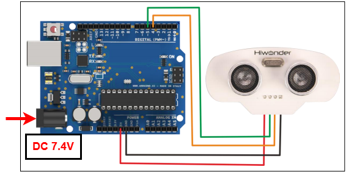

# 2. Arduino Development


## 2.1 Getting Started

### 2.1.1 Wiring Instruction

Follow the diagram below to complete the wiring for this section.



> [!NOTE]
>
> * **When using Hiwonder's lithium battery, connect the battery cable with the red wire to the positive (+) terminal and the black wire to the negative (–) terminal of the DC port.**
>
> * **If the battery is not connected to the cables, do not connect the cable ends directly together. Doing so may cause a short circuit and damage the system.**
>
> * **Before powering on, ensure that no metal objects are touching the controller. Otherwise, the exposed pins at the bottom of the board may cause a short circuit and damage the controller.**

### 2.1.2 Environment Configuration

You can install the Arduino IDE on a PC. Download path: **"[Appendix-> Arduino Installation Package](https://drive.google.com/drive/folders/14LTYZuZ7FePCMK85bTmXPaO3jIvLlgGI?usp=sharing)"** For detailed usage of the Arduino IDE, please refer to the documentation in the same directory.

## 2.2 Test Case

Program to detect distance and displays the specific value in the terminal window.

### 2.2.1 Program Download

1)  For the Arduino and UNO development board equipped with the expansion board, use a USB cable to connect them to the computer. You can open Arduino IDE, click "**File → New,**" and import the program located in the same directory as this tutorial.

2)  <span class="mark">Remember to select the correct development board and port. The ports shown below are for reference only. Then compile and upload the program.</span>


3)  After the code is uploaded, click  to open the serial monitor, set the baud rate to 9600 to observe the output.

### 2.2.2 Project Outcome

The serial monitor displays the distance between the ultrasonic sensor and the obstacle in front, in centimeters.


### 2.2.3 Program Brief Analysis

- **Initialization**

```c++
int inputPin=4; // define ultrasonic signal receiver pin ECHO to D4 
int outputPin=5; // define ultrasonic signal transmitter pin TRIG to D5
 void setup()
{
Serial.begin(9600); 
pinMode(inputPin, INPUT); 
pinMode(outputPin, OUTPUT);
}
```

First, Initialize the interfaces: connect the ultrasonic sensor's ECHO and TRIG pins to D4 and D5, respectively.

Then, initialize the serial port and set D4 as input and D5 as output.

- **Loop Process**

```c++
void loop()
{
digitalWrite(outputPin, LOW); 
delayMicroseconds(2);
digitalWrite(outputPin, HIGH); // Ultrasonic detection is activated by a 10 μs pulse
delayMicroseconds(10); 
digitalWrite(outputPin, LOW);
int distance = pulseIn(inputPin, HIGH); // Read the pulse duration from the receiver 
distance= distance/58; // Convert the pulse duration into distance
Serial.print("Distance:"); 
Serial.print(distance); //Output the data
Serial.println("cm"); 
delay(50);
}
```

Trigger the ultrasonic sensor to perform detection. The measured data is then processed and output to the terminal window.