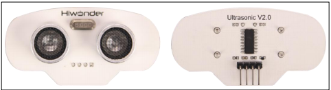
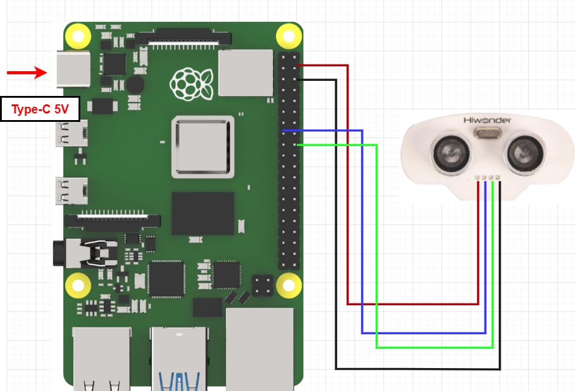

# 3. Raspberry Pi Development Tutorial



## 3.1 Getting Started

### 3.1.1 Wiring Instruction

When wiring, connect the ultrasonic module's positive and negative pins to the Raspberry Pi's corresponding power pins. Connect the TRIG pin to GPIO22 and the ECHO pin to GPIO24.



> [!NOTE]
>
> * **When using Hiwonder's lithium battery, connect the battery cable with the red wire to the positive (+) terminal and the black wire to the negative (–) terminal of the DC port.**
>
> * **If the battery is not connected to the cables, do not connect the cable ends directly together. Doing so may cause a short circuit and damage the system.**

### 3.1.2 Environment Configuration

Install NoMachine on your computer. The software package is located under "**[Appendix-> Remote Desktop Connection Tool](https://drive.google.com/drive/folders/1ITS4OwvKXYVtSplOqO7kgig-IejRPSEn?usp=sharing)**". For the detailed operations of NoMachine, please refer to the same directory.

Drag the program and SDK library files into the Raspberry Pi system image. For demonstration purposes, the files are placed on the Desktop in this example. 

> [!NOTE]
>
> **Make sure the library files are placed in the same directory as the program.**

Open the terminal and enter the command to change to the program directory: 

```bash
sudo chmod a+x Sensor_Demo/
```

## 3.2 Test Case

Program to display the accelerometer sensor status in the Raspberry Pi terminal window.

### 3.2.1 Program Download

1)  Open the terminal and enter the following command to navigate to the program directory and press Enter.

```bash
cd Desktop/Sensor_Demo/
```

2. Run the program by entering:

```bash
python3 UltrasonicSersorDemo.py
```

### 3.2.2 Project Outcome

Place obstacles at varying distances in front of the ultrasonic sensor. The terminal interface will display the distances detected by the sensor in real time.


### 3.2.3 Program Brief Analysis

- **Import Libraries**

```py
import RPi.GPIO as GPIO
import time
if sys.version_info.major == 2:
    print('Please rnu this program with python3!')
    sys.exit(0)
```

Import the `GPIO`, `system`, and `time` libraries on Raspberry Pi. Ensure you are running Python 3.

- **Initialization Sequence**

```py
# Set GPIO pin numbers (设置GPIO针脚编号)
TRIG = 22
ECHO = 24

# Set GPIO mode to BCM (设置GPIO模式为BCM)
GPIO.setmode(GPIO.BCM)

# Set TRIG pin as output, ECHO pin as input (设置TRIG针脚为输出, ECHO针脚为输入)
GPIO.setup(TRIG, GPIO.OUT)
GPIO.setup(ECHO, GPIO.IN)

def distance_measurement():
    # Send ultrasonic pulse (发送超声波脉冲)
    GPIO.output(TRIG, True)
    time.sleep(0.00002)
    GPIO.output(TRIG, False)
```

Initialize the relevant GPIO pins, set their modes, and print their status.

`TRIG = 22`: Sets the TRIG pin number to 22.

`ECHO = 24`: Sets the ECHO pin number to 24.

`GPIO.setmode(GPIO.BCM)`: Sets the GPIO numbering mode to BCM numbering.

`GPIO.setup(TRIG, GPIO.OUT)`: Configures the TRIG pin as an output.

`GPIO.setup(ECHO, GPIO.IN)`: Configures the ECHO pin as an input.

- **Emit an ultrasonic pulse**

```py
def distance_measurement():
    # Send ultrasonic pulse (发送超声波脉冲)
    GPIO.output(TRIG, True)
    time.sleep(0.00002)
    GPIO.output(TRIG, False)

    start_time = time.time()
    stop_time = time.time()

    # Record the time of ultrasonic emission and reception (记录超声波发射和接收的时间)
    while GPIO.input(ECHO) == 0:
        start_time = time.time()

    while GPIO.input(ECHO) == 1:
        stop_time = time.time()
```

Trigger the ultrasonic sensor by setting the TRIG pin to high, pausing briefly, and then setting it to low. Next, record the time when the ultrasonic pulse is sent and when it is received using variables. Timing stops when the ECHO pin detects the returning pulse.

- **Calculating distance**

```py
# Calculate distance (计算距离)
    elapsed_time = stop_time - start_time
    distance = (elapsed_time * 34300) / 2  # 34300 is the speed of sound, unit is cm/s (34300为声速，单位是厘米/秒)
```

Use the function to calculate the ultrasonic pulse's round-trip time, then multiply by half the speed of sound, 34300 cm/s, to determine the distance.

- **Print data**

```py
try:
    while True:
        dist = distance_measurement()
        print(f"距离: {dist:.2f}厘米") 
        time.sleep(0.1)

except KeyboardInterrupt:
    GPIO.cleanup()
```

Call the `distance_measurement` function to obtain the measured distance, then print the value with two decimal places.